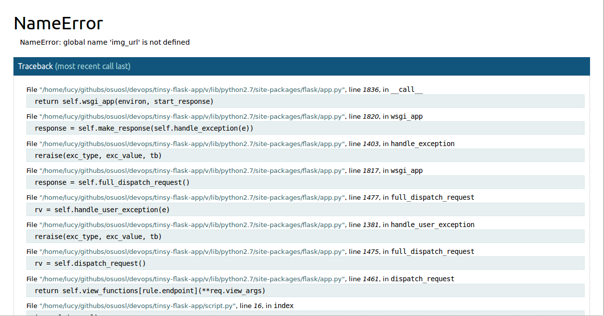

Debugging Exercise
==================

In this exercise, we'll looking at using py-lint and pdb to 
debug our `tinsy flask app`_.  If you haven't already, go ahead 
and clone the repo:

.. code-block:: none

	$ git clone https://github.com/DevOpsBootcamp/tinsy-flask-app.git

Then, you'll want to check out a slightly broken version of the 
app which is living on a different branch, and install it's
dependencies into a virtual environment.

.. code-block:: none

	$ cd tinsy-flask-app
	$ git checkout debugging
	$ virtualenv venv
	$ source venv/bin/activate
	$ pip install -r requirements.txt

The first thing we want to do is make sure the app is working 
as expected. Try running :code:`python script.py`.

Oh no! Our app seems to be broken!  It looks like :code:`img_url`
is not defined. If you look at the very bottom of the stack 
trace pictured above, you can see that we're referring to 
:code:`img_url` on line 16.  Go take a look at the code 
and see if you can find what's missing.

Next, we'll start by running the linter to try to catch any really 
obvious syntactic errors. Python's linter is called `flake8`_, and 
we've already installed it when we ran :code:`pip install`.  

.. code-block:: none

	$ flake8 script.py

Whoa, that seems like a lot of errors for such a small script.
You should see something that looks like this:

.. code-block:: none

	script.py:2:1: F401 'send_file' imported but unused
	script.py:7:75: E502 the backslash is redundant between brackets
	script.py:10:1: E302 expected 2 blank lines, found 1
	script.py:17:41: E502 the backslash is redundant between brackets
	script.py:18:37: E502 the backslash is redundant between brackets
	script.py:27:40: E502 the backslash is redundant between brackets
	script.py:28:46: E502 the backslash is redundant between brackets
	script.py:29:36: F821 undefined name 'img_url'
	script.py:32:1: E302 expected 2 blank lines, found 1
	script.py:37:5: E265 block comment should start with '# '
	script.py:38:9: E261 at least two spaces before inline comment

This is telling us where our errors are. The far left column tells
us the file the error is in, then the line number for the error 
is in the second column (don't worry too much about the 
third column). Then we see the `Error Code`_, such as :code:`F401`
or :code:`E302`.  This defines the type of error that occured,
and that's how the program decides which message to print
and how to handle the error.  The letter, "E" or "F" refers
to the type of error.  "E" or "W" is a `pep8` warning or error.
"F" is a pyflake specific code, "N8" is a naming convention error.
For more details, you can see `Flake8's warnings here`. 

So! If we look at the first error, :code:`script.py:2:1: F401 'send_file' imported but unused`,
we can see that there's a Flake8 warning with code 401 on line 2 of :code:`script.py`. 
If we open up :code:`script.py`, we can see that we are 
importing a bunch of things there. It's telling us one of those things,
:code:`send_file`, isn't actually used in our code, so we don't 
need it.  The reason we don't want to include unnecessary functions
is because they may conflict with our own code, can make
our code unnecessarily heavy (at scale), and are 
generally inefficient.  So let's remove :code:`send_file` from
the list of things to import and run flake8 again.

.. code-block:: none

	(v)lucy@anastasia:~/githubs/osuosl/devops/tinsy-flask-app (debugging)$ flake8 script.py 
	script.py:7:75: E502 the backslash is redundant between brackets
	script.py:10:1: E302 expected 2 blank lines, found 1
	script.py:17:41: E502 the backslash is redundant between brackets
	script.py:18:37: E502 the backslash is redundant between brackets
	script.py:27:40: E502 the backslash is redundant between brackets
	script.py:28:46: E502 the backslash is redundant between brackets
	script.py:29:36: F821 undefined name 'img_url'
	script.py:32:1: E302 expected 2 blank lines, found 1
	script.py:37:5: E265 block comment should start with '# '
	script.py:38:9: E261 at least two spaces before inline comment

Now the error is gone!  Spend a little bit of time (~10 minutes) and 
see how many of the other errors you can make go away.

.. _tinsy flask app: https://github.com/DevOpsBootcamp/tinsy-flask-app
.. _flake8: https://flake8.readthedocs.org/en/latest/
.. _on github: https://github.com/mitsuhiko/flask/issues/1312
.. _Error Code: https://flake8.readthedocs.org/en/latest/warnings.html
.. _Flake8's warnings here: https://flake8.readthedocs.org/en/latest/warnings.html
.. _PDB: https://docs.python.org/3.5/library/pdb.html
